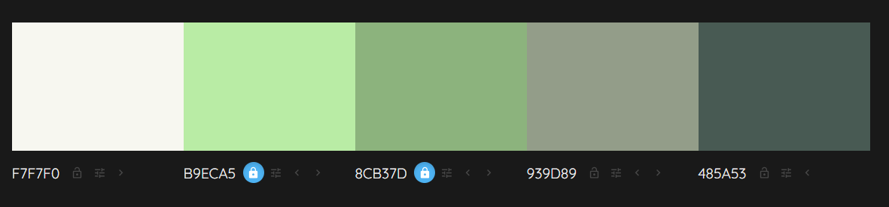

# The Inner Balance Quiz 

## [View the live Project here]

Welcome to The Inner Balance Quiz read.me, this quiz was created for milestone project 2 (Web Development Diploma with Code Institute) and it showcases an educational quiz with a focus on holistic health and 'Inner Balance'.

## User Experience (UX)

### Project Goal
1. Promote Holistic Wellness
- Encourage users to explore and understand the balance between mental, physical, and emotional health through an interactive and engaging quiz.
2. Encourage Self-Reflection
- Help users assess their current well-being by prompting them to reflect on different aspects of their mental, physical, and emotional health.
3. Provide Personalised Insights 
- Offer tailored feedback based on quiz responses to guide users toward achieving a more balanced and healthy lifestyle.

#### User stories

##### First Time Visitor Goals
-  I want to quickly understand the purpose of the quiz, so that I know what value it provides and if it’s relevant to me.
- I want to be able to easily navigate to the quiz and understand how to start, so that I can begin without confusion.
- I want to feel motivated by the quiz design and topic, so that I am encouraged to participate and finish the quiz.
##### Returning Visitor Goals
-  I want to see any improvements or changes in quiz content, so that I can benefit from new or updated information.
- I want to see my past scores or performance, so that I can track my improvement over time.
- I want an easy way to share the quiz with friends or family, so that I can encourage others to try it as well.
##### Frequent Visitor 
- I want to see new or rotating questions, so that each quiz attempt feels fresh and engaging.
- I want an option to save my quiz results or download a summary, so that I can refer to it for personal development.
    
## Design
### Colour Scheme
- The quiz is made up  of light colours such as white and light green. I have also added some dark khaki for contrast.
- [Color Mind](http://colormind.io/) was used to decide which colours complimented eachother. 
### 

### Typography
- The Arima font is used for the heading, with Sans Serif as the fallback font. 
- Work Sans is used in the quiz section, with Sans Serif as the fallback font. I think that this font contrasts well with the headings as it is delicate and neat. 

### Imagery

- [Home hero image](https://www.pexels.com/photo/aerial-view-of-a-cliff-17902495/)
- [Pexels](https://www.pexels.com/) image has been used for the background.

## Wireframes and Structure

### Wireframes

- Home Page Wireframe Desktop- [view](documentation/wireframes/inner-balance-quiz-desktop.png)
- Home Page Wireframe Tablet- [view](documentation/wireframes/inner-balance-quiz-ipad.png)
- Home Page Wireframe Phone- [view](documentation/wireframes/inner-balance-quiz-iphone.png

## Features

-   #### Responsive on all devices - [view](TBC)

### Header and footer
- The header includes a big bold name of the Quiz.
## 
- The footer includes a subscribe to our newsletter button and social media details.
## 

### Interactive elements
 
#### Next question button
- The quiz features a next button which appears once the asnwer has been selected. 
## 

## Technologies

### Languages
- [HTML5](https://en.wikipedia.org/wiki/HTML5) 
- [CSS3](https://en.wikipedia.org/wiki/Cascading_Style_Sheets)
- [JavaScript](https://en.wikipedia.org/wiki/JavaScript)

### Frameworks and Libraries

## Testing

### User Story Testing 

#### Summary

### Links and Functions

#### Functionality 
- Create a progress bar, the progress bar is made out of spans. The number of spans depends on the number of questions presented in the questionaire. The function creates a span element in the html file every time is sees a question in the questions section. 
- The function then highlights all completed questions by adding a class 'seen' to all questions which have been answered. The 'seen' class is marked as a different colour in css therefore it creates a progress bar which shows how many questions the user has gotten through.
- Questions from the array are inserted into the questions section depending on the index. 
- Answers from the array are inserted into the questions section depending on the index. 

### Browser Testing

#### Devices: 

### Google Dev Tools & Lighthouse

- [Google DevTools](https://developer.chrome.com/docs/devtools/) and Lighthouse have been used for testing and amending the project.

#### Page Performance (Desktop)

### Validator testing

[HTML Validator- View final results here.]()
[CSS Validator- View final results here.]()

### Bug Fixes 

### Known Bugs

## Deployment

- Log into GitHub account
- Head to the project repository
- Click on the "settings" tab near the top right of the page
- Then to "pages" on the setting menu-left hand side
- Source select "deploy from a branch"
- Branch select "main" & "root"
- Hit save
- After a couple of minutes the site is now live.

## Credits
### Code
- General coding advice [W3School](https://www.w3schools.com/)
- Javascript cheat sheet used to resolve any confusion and extend my knowledge [Javascript cheat sheet](https://hackr.io/blog/javascript-cheat-sheet)
## Acknowledgments
